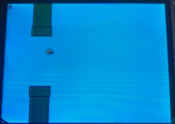

# MICRO-MANIA

This repository contains files relating to the final project in the course Microprocessor Applications 2. Each team had 3 members and 2 weeks to create a game built on top of the Real-Time Operating System we developed during the first 2 months of the course. Our project consisted of 4 mini-games played on the TI MSP432 launchpad (powered by ARM Cortex-M4) . Of our 4 mini-games, one was single player and three were multiplayer (using TI's CC3100 network processor).

## 1. Hardware

Each of the game console systems contained the hardware summarized below.

**Primary Development Board**
- The primary dev board used for this project is Texas Instrument's [MSP432P401R launchpad](https://www.digikey.com/product-detail/en/texas-instruments/MSP-EXP432P401R/296-39653-ND/5170609?utm_adgroup=Programmers%20Dev&utm_source=google&utm_medium=cpc&utm_campaign=Dynamic%20Search&utm_term=&utm_content=Programmers%20Dev&gclid=CjwKCAjw8df2BRA3EiwAvfZWaOgytQmXXzaZwAcTeqqKzGvp99005kN3yQMMQ2ZUGjG0ndnfPLmGoxoCn70QAvD_BwE).
- The target processor for the RTOS and game software was the launchpad's ARM Cortex-M4.
- Cpu clock of 48 MHz.
- RAM of 64 KB to share between the RTOS, 4 games, and the menu.

**Additional Hardware**
- To enable board-to-board communication via UDP, each launchpad interfaced a TI [CC3100 SimpleLink](https://www.digikey.com/product-detail/en/texas-instruments/CC3100BOOST/296-37769-ND/4862810?utm_adgroup=RF%2FIF%20and%20RFID&utm_source=google&utm_medium=cpc&utm_campaign=Shopping_Texas%20Instruments_0296_Co-op&utm_term=&utm_content=RF%2FIF%20and%20RFID&gclid=CjwKCAjw8df2BRA3EiwAvfZWaJutkkvgnPuYSjb0I8DprFYE4M8eggaCiC-Tff1q4PmoknfxObZhlxoCDgAQAvD_BwE) networking backpack and utilized a TI library that implemented SendPacket and ReceivePacket functions.
-  Each console's launchpad connected to Professor Jin's custom EEL4930 PCB that contained a touchscreen LCD controllable via SPI, RGB LEDs controllable via PWM, 4 buttons and an analog stick that is readable via interrupt or polling lines.

***Figure 1.1:** Photo of the two boards this repository's code ran on.*

## 2. RTOS

During the first 5 assignments of the course, each student developed their own RTOS and applications to demo new working features of the operating system. The most important aspects of the RTOS are listed below.

- Scheduler supported background threads, periodic threads, and aperiodic threads.
- Scheduler supported preemptive scheduling of all threads based on user-defined priorities.
- Implemented mutex and semaphore for thread synchronization.
- Implemented interprocess Communication (IPC) between threads using pipes.

Related Files:
[RTOS Folder](https://github.com/digitaldanny/micro-mania/tree/master/rtos)

## 3. Games

Although none of the games developed in this project were highly complex, this project was large enough that we had to consider hardware limitations during development. Below are some hardware limitations we considered during development of all games.

**Hardware Limitations**

- 48 MHz CPU
	- SPI clock for writing to LCD is a fraction of the system clock. Because our games required updating the entire LCD frequently, we rewired the dev board / LCD connections to work in parallel mode rather than SPI mode. This allowed ~16x faster LCD updating and saved CPU cycles for game processing.
- 64 KB of RAM
	- Shared between RTOS, all 4 games, and the menu.
	- Minimized number of RTOS threads and stack size required to run the games without crashing.
	- Avoided allocating large arrays on the stack in game threads.

### 3.1 Slither (Designed and Developed by Daniel Hamilton)

This game is a limited recreation of the browser game _Slither.IO_, which is reminiscent of the classic arcade game _Snake_. The goal of the game is to kill the other player's snake by tricking him into running into your side while eating randomly spawned apples on the map to grow longer. Below are some photos of gameplay.

  
   

***Figure 3.1-3.2:** In-game pictures from player 1's perspective (blue snake). In the left, player 1 is collecting apples in the center of the map so not much of the black borders are shown. On the right, player 1 is very close to the bottom, right edge of the map so a lot of black border is shown.*

Although the game is simple in concept, development on an embedded system was challenging due to hardware limitations. Below are some specific challenges faced while developing this game.

**Slither Challenges**

- The snake's head is positioned in the center of the map. Because of this, the snake had to be redrawn each time the player moved. This was increasingly CPU intensive as the snack grew larger. To combat this, only portions of the snake that would not be redrawn were erased.

- Keeping track of an array of randomly spawning food items on both devices at the same time. To keep track of food items, the host was in charge of randomly spawning new food items and notifying the client device of the new food's location. Eating food was handled in a similar fashion.

Related Files:
[Core Game](https://github.com/digitaldanny/micro-mania/blob/master/src/game3.c)
[Snake Functions](https://github.com/digitaldanny/micro-mania/blob/master/src/game3_snake_functions.c)

### 3.2 Flappy Bird (Designed and Developed by Jacob Crain)

This game is a recreation of the hit mobile game _Flappy Bird_ where the player uses a button to control the bird and guide it through randomly spawning pipe obstacles. The goal of the game is to beat your highest score, which is the number of pipes you have cleared successfully. Upon colliding with a pipe, the player dies and restarts the game. As the game progresses, the pipes approach more quickly and frequently to increase the challenge. Below is a picture of early gameplay.

***Figure 3.3:** In-game picture of Flappy Bird during the early stages of the game.*

Although this game is single player, our implementation allows two players to take turns playing the game while the other player watches.

Related Files:
[Core Game](https://github.com/digitaldanny/micro-mania/blob/master/src/game1.c)

### 3.3 Other Games (Designed and Developed by Jacob Crain and Matthew Dolan)

We also implemented two other games called _Tiles_ and _Goomball_. 

_Tiles_ is a single player memorization-based game where a 4x4 table of tiles with 8 colors are shown to the player at the start of the game.  Each tile has a matching tile with the same color. After 3 seconds, all tiles are flipped over and the player has 3 attempts to guess where all the pairs are.

***Figure 3.4:** In-game picture of Tiles after the player has guessed 6 of the color pairs.*

_Goomball_ is a multiplayer Mario-themed game where both players try to avoid getting hit by the goombas. The last person alive wins the match. The main goal of this game was to experiment with using sprites from images on our LCD.

***Figure 3.5:** In-game picture of Gameball where the players, Mario and Luigi, are avoiding the CPU Goombas.*

## 4. Contributors

Daniel Hamilton [**(@sweatpantsdanny)**](https://github.com/sweatpantsdanny)

Jacob Crain [**(@Jake16000)**](https://github.com/Jake16000)

Matthew Dolan [**(@mattbuster)**](https://github.com/mattbuster)
